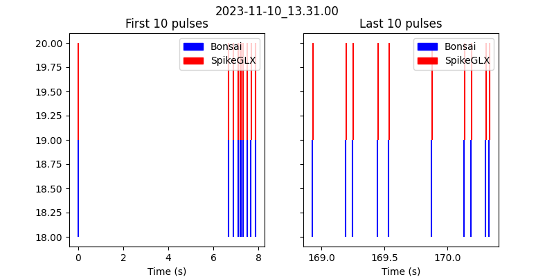
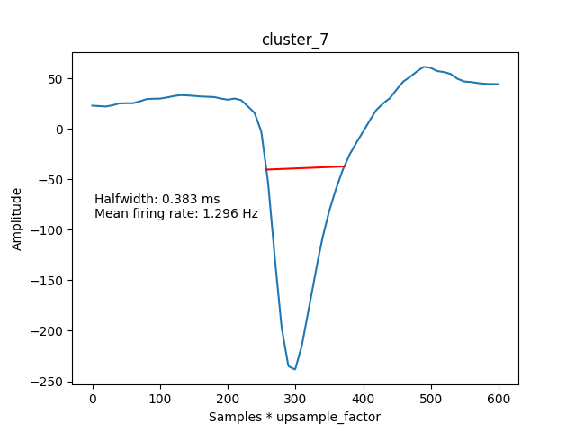
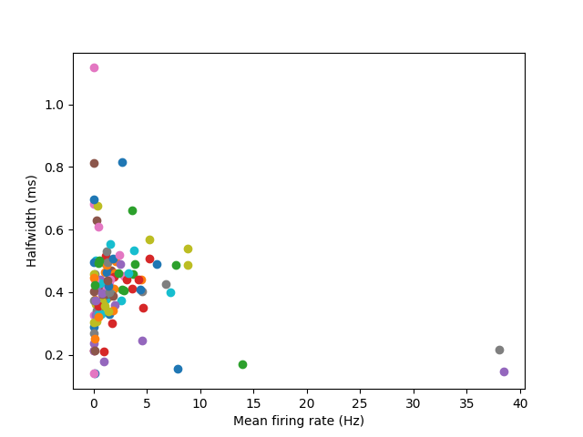

# rename_bonsai_files.py		

Fixes the datestamp issue with Bonsai, where it is always one 
filename behind the honeycomb task script. Uses the times when 
the files were modified to correctly match them. 
RUN THIS BEFORE RUNNING ANY OTHER CODE!!!!!

# extract_pulses_from_raw.py	

Finds the digital pulses emitted by Bonsai and recorded by SpikeGLX 
by reading the final channel of the binary file. Saves them to an 
h5 file.

# get_pulses.py			

Reads in the pulse timings recorded by Bonsai, and matches them to the 
pulses read from the SpikeGLX data. It produces plots to allow the 
user to confirm that the SpikeGLX pulses are correctly aligned to the 
Bonsai data. The Bonsai pulses (in computer time (ms)) and the SpikeGLX 
pulses (in samples) are combined into a 2d array and saved as a list of 
arrays as an H5 file. Figures are plotted to allow the user to confirm 
that pulses have been correctly aligned (see below).

# get_video_endpoints

Video recording, in most cases, went beyond the end of the trial (i.e. 
the experimenter can be seen at the end of the videos coming in to the 
arena with the food reward), and so an endpoint for each video needs 
to be determined. The user needs to open the video in VLC, scan to what
they determine to be the end of the video, and enter the end time in 
minutes:seconds format (as can be viewed directly from VLC). 
This module also contains a function from trimming the start (there is 
usually a solitary frame that is acquired, then an interval of a few 
seconds before video starts recording at the correct frame rate, so we
trim it); this function is called from process_dlc_data.py.

# process_dlc_data.py		

Extracts the positional data from deeplabcut. Loads the pulse file 
generated by get_pulses.py and interpolates the time in samples to match 
with the unit data. Then trims the dlc data at the beginning and end 
using the trim points calculated by the get_video_endpoints.py module. 

# load_behaviour.py		

Loads in the behavioural csv files, and saves the data as a dictionary 
of dataframes. Can also sort trials according to the goal 
(behaviour_data_by_goal.pkl).
				
# calculate_pos_and_dir.py

Calculates the animal's current platform, as well as the goal directions from 
its current position, and its head direction relative to each of the goals
and TV screens.

Note that the function get_screen_coordinates requires a full size video
frame. However, if you have run the function before on another dataset, 
just copy the file screen_coordinates.pickle from that sessions deeplabcut 
folder to the same folder in the current session. 

Also, note that this code doesn't save the DLC data to a new file, instead,
it adds it to the existing file (dlc_final.pickle) so as to avoid saving
an increasing number of increasingly large files. If unsure, simply open
the pickle file, and check if the relative directions to goals and tv
screens is included, in which case this code has already been run. You 
can use the function load_pickle from load_and_save_data.py 
(dlc_final = load_pickle('dlc_final', dlc_dir)). 

# create_videos_with_dlc_data.py	

Produces videos with a red arrow tracking head position and direction. 
In the cropped videos it produces, it super-imposes a red END over the 
frames that come past the endpoint for manual verification. 

# load_sorted_spikes.py		

Loads the clusters classified as good in Phy (need to verify the cluster 
qualities are mine, and not kilosort's). Saves them in a dictionary with the 
cluster numbers as the keys, and the spike times in samples as the data. 
File is unit_spike_times.pickle. 

# restrict_spikes_to_trials.py	

Splits units into a dictionary with trial times as the keys. Removes inter-
trial spikes. 

# classify_neurons.py 		

Calculates mean firing rates and average waveforms, from which spike width 
can be calculated. Plots a scatter plot of mean rates vs spike width, 
from which it is possible to manually identify the interneurons. Once we 
have more sessions to look at, we can determine thresholds/cutoffs to 
automate the identification of principal and interneurons; for now, go 
through the plots, and manually enter a spike-width cut-off. 
				

# calculate_occupancy.py

# calculate_spike_pos_hd.py

# plot_spikes_pos.py

# calculate_consinks

# calculate_consink_shuffles.py OR calculate_consink_shuffles_hpc.py

# calculate_vector_fields.py

# plot_channel_map.py

